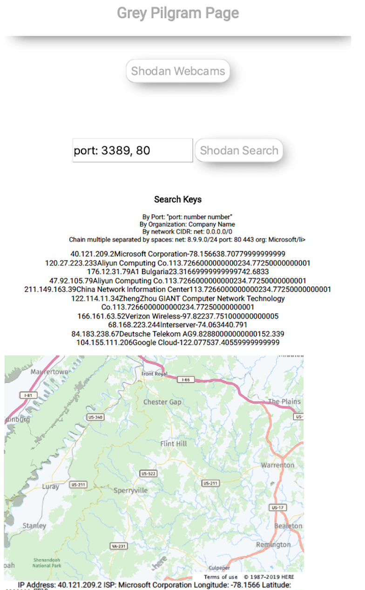

# Purpose
This website shows a web front end in javascript for searching the Shodan API.
It requires a key for functionality from Shodan.io.

## Current Functionality
1. Clone repository.
2. Register for API key at Shodan.io.
3. Copy API key into javascript file.
4. Run local HTTP server.
5. Have fun!

[Demo Website](https://karadikid.github.io/shodan-api-js/)
